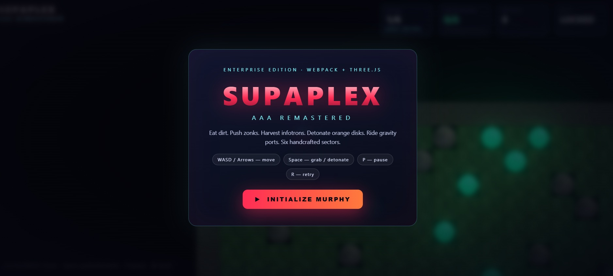
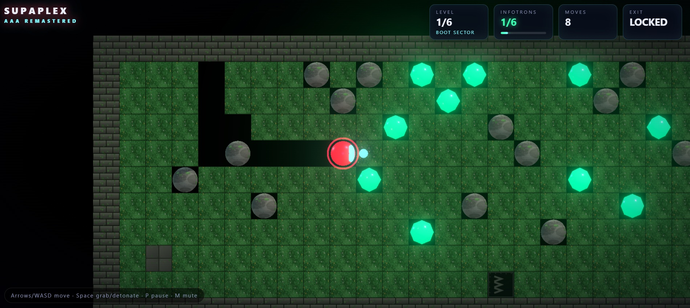

# SUPAPLEX — AAA Remastered

▶ **Play it live: https://victorzakharov.github.io/supaplex-muse13/**

Enterprise-grade Supaplex clone. Webpack 5 + TypeScript + Three.js with bloom post-processing,
GPU particles, cinematic lighting, synth audio, and six handcrafted sectors.

## Screenshots

<table>
  <tr>
    <td width="50%" align="center"><strong>Main menu</strong><br/></td>
    <td width="50%" align="center"><strong>Gameplay — Boot Sector</strong><br/></td>
  </tr>
</table>

## Quick start

```bash
npm install
npm run dev     # http://localhost:8080
npm run build   # production bundle in dist/
```

## Controls

| Key | Action |
| --- | ------ |
| Arrows / WASD | Move Murphy |
| Space | Grab / detonate adjacent disk, confirm dialogs |
| P / Esc | Pause |
| R | Retry level |
| N | Skip level (debug) |
| M | Mute |

## Architecture

```
src/
├── core/          # Config, EventBus, Logger, InputManager
├── game/          # Tiles, LevelGrid, PhysicsEngine, GameSession, Levels, AudioEngine, Game
├── gfx/           # MaterialFactory, LightingRig, ParticleSystem, BackgroundDome, TileMeshBuilder, WorldRenderer
├── ui/            # Hud, styles.css
├── index.html
└── main.ts
```

- **Simulation**: fixed-timestep grid physics (12 ticks/sec) — gravity, rolling zonks,
  pushable boulders, orange/yellow disk fuses with chain reactions, gravity ports,
  crush detection, exit gating.
- **Rendering**: Three.js PBR neon materials, shadow-casting key light, player-following
  point light, UnrealBloom post-processing, 2400-particle GPU system, shockwave rings,
  starfield + shader nebula background, smooth camera with screen shake.
- **Audio**: WebAudio synth — no assets needed. Procedural SFX + bassline loop.

## Levels

1. Boot Sector — basics
2. Gravity Wells — rolling physics
3. Orange Protocol — disk demolition
4. Port Authority — gravity ports
5. Yellow Fever — chain reactions
6. Core Meltdown — everything combined

## Related Supaplex projects

- [Supaplex Deepseek V4-F](https://github.com/VictorZakharov/supaplex-deepseek-v4-f)
- [Supaplex Sonnet 5](https://github.com/VictorZakharov/supaplex-sonnet5)
- [Neonplex](https://github.com/VictorZakharov/neonplex)
